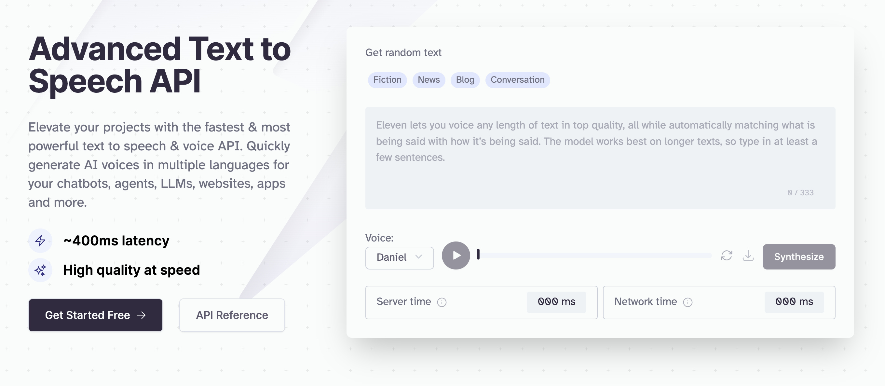

<div align="center">

[](https://elevenlabs.com)

# [Elevenlabs](https://elevenlabs.com)<a id="elevenlabs"></a>

This is the documentation for the ElevenLabs API. You can use this API to use our service programmatically, this is done by using your xi-api-key. <br/> You can view your xi-api-key using the 'Profile' tab on https://elevenlabs.io. Our API is experimental so all endpoints are subject to change.

</div>

## Table of Contents<a id="table-of-contents"></a>

<!-- toc -->

- [Installation](#installation)
- [Getting Started](#getting-started)
- [Reference](#reference)
  * [`elevenlabs.pronunciationDictionary.createFromFile`](#elevenlabspronunciationdictionarycreatefromfile)
  * [`elevenlabs.pronunciationDictionary.getMetadata`](#elevenlabspronunciationdictionarygetmetadata)
  * [`elevenlabs.audioNative.createProjectWithEmbeddableHtml`](#elevenlabsaudionativecreateprojectwithembeddablehtml)
  * [`elevenlabs.dubbing.deleteProject`](#elevenlabsdubbingdeleteproject)
  * [`elevenlabs.dubbing.fileInLanguage`](#elevenlabsdubbingfileinlanguage)
  * [`elevenlabs.dubbing.getFile`](#elevenlabsdubbinggetfile)
  * [`elevenlabs.dubbing.getProjectMetadata`](#elevenlabsdubbinggetprojectmetadata)
  * [`elevenlabs.models.listAvailableModels`](#elevenlabsmodelslistavailablemodels)
  * [`elevenlabs.projects.createNewProject`](#elevenlabsprojectscreatenewproject)
  * [`elevenlabs.projects.deleteById`](#elevenlabsprojectsdeletebyid)
  * [`elevenlabs.projects.deleteChapterById`](#elevenlabsprojectsdeletechapterbyid)
  * [`elevenlabs.projects.getAllProjects`](#elevenlabsprojectsgetallprojects)
  * [`elevenlabs.projects.getById`](#elevenlabsprojectsgetbyid)
  * [`elevenlabs.projects.getChapterById`](#elevenlabsprojectsgetchapterbyid)
  * [`elevenlabs.projects.getChapterSnapshots`](#elevenlabsprojectsgetchaptersnapshots)
  * [`elevenlabs.projects.listChapters`](#elevenlabsprojectslistchapters)
  * [`elevenlabs.projects.listSnapshots`](#elevenlabsprojectslistsnapshots)
  * [`elevenlabs.projects.startChapterConversion`](#elevenlabsprojectsstartchapterconversion)
  * [`elevenlabs.projects.startConversion`](#elevenlabsprojectsstartconversion)
  * [`elevenlabs.projects.streamAudioFromSnapshot`](#elevenlabsprojectsstreamaudiofromsnapshot)
  * [`elevenlabs.projects.streamAudioFromSnapshotPost`](#elevenlabsprojectsstreamaudiofromsnapshotpost)
  * [`elevenlabs.projects.updatePronunciationDictionaries`](#elevenlabsprojectsupdatepronunciationdictionaries)
  * [`elevenlabs.redirect.toMintlifyDocsGet`](#elevenlabsredirecttomintlifydocsget)
  * [`elevenlabs.samples.getAudioFromSample`](#elevenlabssamplesgetaudiofromsample)
  * [`elevenlabs.samples.removeById`](#elevenlabssamplesremovebyid)
  * [`elevenlabs.speechHistory.deleteHistoryItemById`](#elevenlabsspeechhistorydeletehistoryitembyid)
  * [`elevenlabs.speechHistory.downloadHistoryItems`](#elevenlabsspeechhistorydownloadhistoryitems)
  * [`elevenlabs.speechHistory.getGeneratedAudioMetadata`](#elevenlabsspeechhistorygetgeneratedaudiometadata)
  * [`elevenlabs.speechHistory.getHistoryItemAudio`](#elevenlabsspeechhistorygethistoryitemaudio)
  * [`elevenlabs.speechHistory.getHistoryItemById`](#elevenlabsspeechhistorygethistoryitembyid)
  * [`elevenlabs.speechToSpeech.createWithVoice`](#elevenlabsspeechtospeechcreatewithvoice)
  * [`elevenlabs.speechToSpeech.createWithVoice_0`](#elevenlabsspeechtospeechcreatewithvoice_0)
  * [`elevenlabs.textToSpeech.convertTextToSpeech`](#elevenlabstexttospeechconverttexttospeech)
  * [`elevenlabs.textToSpeech.convertTextToSpeechStream`](#elevenlabstexttospeechconverttexttospeechstream)
  * [`elevenlabs.user.getInfo`](#elevenlabsusergetinfo)
  * [`elevenlabs.user.getSubscriptionInfo`](#elevenlabsusergetsubscriptioninfo)
  * [`elevenlabs.voiceGeneration.createVoice`](#elevenlabsvoicegenerationcreatevoice)
  * [`elevenlabs.voiceGeneration.generateRandomVoice`](#elevenlabsvoicegenerationgeneraterandomvoice)
  * [`elevenlabs.voiceGeneration.getVoiceGenerationParameters`](#elevenlabsvoicegenerationgetvoicegenerationparameters)
  * [`elevenlabs.voices.addToCollection`](#elevenlabsvoicesaddtocollection)
  * [`elevenlabs.voices.addVoiceToCollection`](#elevenlabsvoicesaddvoicetocollection)
  * [`elevenlabs.voices.deleteById`](#elevenlabsvoicesdeletebyid)
  * [`elevenlabs.voices.editSettingsPost`](#elevenlabsvoiceseditsettingspost)
  * [`elevenlabs.voices.getDefaultVoiceSettings`](#elevenlabsvoicesgetdefaultvoicesettings)
  * [`elevenlabs.voices.getSettings`](#elevenlabsvoicesgetsettings)
  * [`elevenlabs.voices.getSharedVoices`](#elevenlabsvoicesgetsharedvoices)
  * [`elevenlabs.voices.getVoiceMetadata`](#elevenlabsvoicesgetvoicemetadata)
  * [`elevenlabs.voices.listAllVoices`](#elevenlabsvoiceslistallvoices)
  * [`elevenlabs.voices.updateVoiceById`](#elevenlabsvoicesupdatevoicebyid)
  * [`elevenlabs.workspace.getSsoProviderAdmin`](#elevenlabsworkspacegetssoprovideradmin)

<!-- tocstop -->

## Installation<a id="installation"></a>
<div align="center">
  <a href="https://konfigthis.com/sdk-sign-up?company=ElevenLabs&language=TypeScript">
    
  </a>
</div>

## Getting Started<a id="getting-started"></a>

```typescript
import { ElevenLabs } from "eleven-labs-typescript-sdk";

const elevenlabs = new ElevenLabs({
  // Defining the base path is optional and defaults to https://api.elevenlabs.io
  // basePath: "https://api.elevenlabs.io",
});

const createFromFileResponse =
  await elevenlabs.pronunciationDictionary.createFromFile({
    name: "name_example",
  });

console.log(createFromFileResponse);
```

## Reference<a id="reference"></a>


### `elevenlabs.pronunciationDictionary.createFromFile`<a id="elevenlabspronunciationdictionarycreatefromfile"></a>

Creates a new pronunciation dictionary from a lexicon .PLS file

#### 🛠️ Usage<a id="🛠️-usage"></a>

```typescript
const createFromFileResponse =
  await elevenlabs.pronunciationDictionary.createFromFile({
    name: "name_example",
  });
```

#### ⚙️ Parameters<a id="⚙️-parameters"></a>

##### name: `string`<a id="name-string"></a>

The name of the pronunciation dictionary, used for identification only.

##### xiApiKey: `string`<a id="xiapikey-string"></a>

Your API key. This is required by most endpoints to access our API programatically. You can view your xi-api-key using the \'Profile\' tab on the website.

##### description: `string`<a id="description-string"></a>

A description of the pronunciation dictionary, used for identification only.

##### file: `Uint8Array | File | buffer.File`<a id="file-uint8array--file--bufferfile"></a>

A lexicon .pls file which we will use to initialize the project with.

#### 🔄 Return<a id="🔄-return"></a>

[AddPronunciationDictionaryResponseModel](./models/add-pronunciation-dictionary-response-model.ts)

#### 🌐 Endpoint<a id="🌐-endpoint"></a>

`/v1/pronunciation-dictionaries/add-from-file` `POST`

[🔙 **Back to Table of Contents**](#table-of-contents)

---


### `elevenlabs.pronunciationDictionary.getMetadata`<a id="elevenlabspronunciationdictionarygetmetadata"></a>

Get metadata for a pronunciation dictionary

#### 🛠️ Usage<a id="🛠️-usage"></a>

```typescript
const getMetadataResponse =
  await elevenlabs.pronunciationDictionary.getMetadata({
    pronunciationDictionaryId: "pronunciationDictionaryId_example",
  });
```

#### ⚙️ Parameters<a id="⚙️-parameters"></a>

##### pronunciationDictionaryId: `string`<a id="pronunciationdictionaryid-string"></a>

The id of the pronunciation dictionary

##### xiApiKey: `string`<a id="xiapikey-string"></a>

Your API key. This is required by most endpoints to access our API programatically. You can view your xi-api-key using the \'Profile\' tab on the website.

#### 🔄 Return<a id="🔄-return"></a>

[GetPronunciationDictionaryMetadataResponseModel](./models/get-pronunciation-dictionary-metadata-response-model.ts)

#### 🌐 Endpoint<a id="🌐-endpoint"></a>

`/v1/pronunciation-dictionaries/{pronunciation_dictionary_id}` `GET`

[🔙 **Back to Table of Contents**](#table-of-contents)

---


### `elevenlabs.audioNative.createProjectWithEmbeddableHtml`<a id="elevenlabsaudionativecreateprojectwithembeddablehtml"></a>

Creates AudioNative enabled project, optionally starts conversion and returns project id and embeddable html snippet.

#### 🛠️ Usage<a id="🛠️-usage"></a>

```typescript
const createProjectWithEmbeddableHtmlResponse =
  await elevenlabs.audioNative.createProjectWithEmbeddableHtml({
    name: "name_example",
    small: false,
    sessionization: 0,
    file: fs.readFileSync("/path/to/file"),
    auto_convert: false,
  });
```

#### ⚙️ Parameters<a id="⚙️-parameters"></a>

##### name: `string`<a id="name-string"></a>

Project name.

##### file: `Uint8Array | File | buffer.File`<a id="file-uint8array--file--bufferfile"></a>

Either txt or HTML input file containing the article content. HTML should be formatted as follows \\\'&lt;html&gt;&lt;body&gt;&lt;div&gt;&lt;p&gt;Your content&lt;/p&gt;&lt;h5&gt;More of your content&lt;/h5&gt;&lt;p&gt;Some more of your content&lt;/p&gt;&lt;/div&gt;&lt;/body&gt;&lt;/html&gt;\\\'

##### xiApiKey: `string`<a id="xiapikey-string"></a>

Your API key. This is required by most endpoints to access our API programatically. You can view your xi-api-key using the \'Profile\' tab on the website.

##### title: `string`<a id="title-string"></a>

Title used in the player and inserted at the top of the uploaded article. If not provided, the default title set in the Player settings is used.

##### image: `string`<a id="image-string"></a>

Image URL used in the player. If not provided, default image set in the Player settings is used.

##### author: `string`<a id="author-string"></a>

Author used in the player and inserted at the start of the uploaded article. If not provided, the default author set in the Player settings is used.

##### small: `boolean`<a id="small-boolean"></a>

Whether to use small player or not. If not provided, default value set in the Player settings is used.

##### textColor: `string`<a id="textcolor-string"></a>

Text color used in the player. If not provided, default text color set in the Player settings is used.

##### backgroundColor: `string`<a id="backgroundcolor-string"></a>

Background color used in the player. If not provided, default background color set in the Player settings is used.

##### sessionization: `number`<a id="sessionization-number"></a>

Specifies for how many minutes to persist the session across page reloads. If not provided, default sessionization set in the Player settings is used.

##### voiceId: `string`<a id="voiceid-string"></a>

Voice ID used to voice the content. If not provided, default voice ID set in the Player settings is used.

##### modelId: `string`<a id="modelid-string"></a>

TTS Model ID used in the player. If not provided, default model ID set in the Player settings is used.

##### autoConvert: `boolean`<a id="autoconvert-boolean"></a>

Whether to auto convert the project to audio or not.

#### 🔄 Return<a id="🔄-return"></a>

[AudioNativeCreateProjectResponseModel](./models/audio-native-create-project-response-model.ts)

#### 🌐 Endpoint<a id="🌐-endpoint"></a>

`/v1/audio-native` `POST`

[🔙 **Back to Table of Contents**](#table-of-contents)

---


### `elevenlabs.dubbing.deleteProject`<a id="elevenlabsdubbingdeleteproject"></a>

Deletes a dubbing project.

#### 🛠️ Usage<a id="🛠️-usage"></a>

```typescript
const deleteProjectResponse = await elevenlabs.dubbing.deleteProject({
  dubbingId: "dubbingId_example",
});
```

#### ⚙️ Parameters<a id="⚙️-parameters"></a>

##### dubbingId: `string`<a id="dubbingid-string"></a>

ID of the dubbing project.

##### xiApiKey: `string`<a id="xiapikey-string"></a>

Your API key. This is required by most endpoints to access our API programatically. You can view your xi-api-key using the \'Profile\' tab on the website.

#### 🌐 Endpoint<a id="🌐-endpoint"></a>

`/v1/dubbing/{dubbing_id}` `DELETE`

[🔙 **Back to Table of Contents**](#table-of-contents)

---


### `elevenlabs.dubbing.fileInLanguage`<a id="elevenlabsdubbingfileinlanguage"></a>

Dubs provided audio or video file into given language.

#### 🛠️ Usage<a id="🛠️-usage"></a>

```typescript
const fileInLanguageResponse = await elevenlabs.dubbing.fileInLanguage({
  source_lang: "auto",
  target_lang: "target_lang_example",
  num_speakers: 0,
  watermark: false,
  highest_resolution: false,
  dubbing_studio: false,
});
```

#### ⚙️ Parameters<a id="⚙️-parameters"></a>

##### targetLang: `string`<a id="targetlang-string"></a>

Target language.

##### xiApiKey: `string`<a id="xiapikey-string"></a>

Your API key. This is required by most endpoints to access our API programatically. You can view your xi-api-key using the \'Profile\' tab on the website.

##### mode: `string`<a id="mode-string"></a>

automatic or manual.

##### file: `Uint8Array | File | buffer.File`<a id="file-uint8array--file--bufferfile"></a>

One or more audio files to clone the voice from

##### csvFile: `Uint8Array | File | buffer.File`<a id="csvfile-uint8array--file--bufferfile"></a>

CSV file containing transcription/translation metadata

##### foregroundAudioFile: `Uint8Array | File | buffer.File`<a id="foregroundaudiofile-uint8array--file--bufferfile"></a>

For use only with csv input

##### backgroundAudioFile: `Uint8Array | File | buffer.File`<a id="backgroundaudiofile-uint8array--file--bufferfile"></a>

For use only with csv input

##### name: `string`<a id="name-string"></a>

Name of the dubbing project.

##### sourceUrl: `string`<a id="sourceurl-string"></a>

URL of the source video/audio file.

##### sourceLang: `string`<a id="sourcelang-string"></a>

Source language.

##### numSpeakers: `number`<a id="numspeakers-number"></a>

Number of speakers to use for the dubbing.

##### watermark: `boolean`<a id="watermark-boolean"></a>

Whether to apply watermark to the output video.

##### startTime: `number`<a id="starttime-number"></a>

Start time of the source video/audio file.

##### endTime: `number`<a id="endtime-number"></a>

End time of the source video/audio file.

##### highestResolution: `boolean`<a id="highestresolution-boolean"></a>

Whether to use the highest resolution available.

##### dubbingStudio: `boolean`<a id="dubbingstudio-boolean"></a>

Whether to prepare dub for edits in dubbing studio.

#### 🔄 Return<a id="🔄-return"></a>

[DoDubbingResponseModel](./models/do-dubbing-response-model.ts)

#### 🌐 Endpoint<a id="🌐-endpoint"></a>

`/v1/dubbing` `POST`

[🔙 **Back to Table of Contents**](#table-of-contents)

---


### `elevenlabs.dubbing.getFile`<a id="elevenlabsdubbinggetfile"></a>

Returns dubbed file.

#### 🛠️ Usage<a id="🛠️-usage"></a>

```typescript
const getFileResponse = await elevenlabs.dubbing.getFile({
  dubbingId: "dubbingId_example",
  languageCode: "languageCode_example",
});
```

#### ⚙️ Parameters<a id="⚙️-parameters"></a>

##### dubbingId: `string`<a id="dubbingid-string"></a>

ID of the dubbing project.

##### languageCode: `string`<a id="languagecode-string"></a>

ID of the language.

##### xiApiKey: `string`<a id="xiapikey-string"></a>

Your API key. This is required by most endpoints to access our API programatically. You can view your xi-api-key using the \'Profile\' tab on the website.

#### 🌐 Endpoint<a id="🌐-endpoint"></a>

`/v1/dubbing/{dubbing_id}/audio/{language_code}` `GET`

[🔙 **Back to Table of Contents**](#table-of-contents)

---


### `elevenlabs.dubbing.getProjectMetadata`<a id="elevenlabsdubbinggetprojectmetadata"></a>

Returns metadata about a dubbing project, including whether it's still in progress or not

#### 🛠️ Usage<a id="🛠️-usage"></a>

```typescript
const getProjectMetadataResponse = await elevenlabs.dubbing.getProjectMetadata({
  dubbingId: "dubbingId_example",
});
```

#### ⚙️ Parameters<a id="⚙️-parameters"></a>

##### dubbingId: `string`<a id="dubbingid-string"></a>

ID of the dubbing project.

##### xiApiKey: `string`<a id="xiapikey-string"></a>

Your API key. This is required by most endpoints to access our API programatically. You can view your xi-api-key using the \'Profile\' tab on the website.

#### 🌐 Endpoint<a id="🌐-endpoint"></a>

`/v1/dubbing/{dubbing_id}` `GET`

[🔙 **Back to Table of Contents**](#table-of-contents)

---


### `elevenlabs.models.listAvailableModels`<a id="elevenlabsmodelslistavailablemodels"></a>

Gets a list of available models.

#### 🛠️ Usage<a id="🛠️-usage"></a>

```typescript
const listAvailableModelsResponse = await elevenlabs.models.listAvailableModels(
  {}
);
```

#### ⚙️ Parameters<a id="⚙️-parameters"></a>

##### xiApiKey: `string`<a id="xiapikey-string"></a>

Your API key. This is required by most endpoints to access our API programatically. You can view your xi-api-key using the \'Profile\' tab on the website.

#### 🔄 Return<a id="🔄-return"></a>

[ModelResponseModel](./models/model-response-model.ts)

#### 🌐 Endpoint<a id="🌐-endpoint"></a>

`/v1/models` `GET`

[🔙 **Back to Table of Contents**](#table-of-contents)

---


### `elevenlabs.projects.createNewProject`<a id="elevenlabsprojectscreatenewproject"></a>

Creates a new project, it can be either initialized as blank, from a document or from a URL.

#### 🛠️ Usage<a id="🛠️-usage"></a>

```typescript
const createNewProjectResponse = await elevenlabs.projects.createNewProject({
  name: "name_example",
  default_title_voice_id: "default_title_voice_id_example",
  default_paragraph_voice_id: "default_paragraph_voice_id_example",
  default_model_id: "default_model_id_example",
  quality_preset: "standard",
  acx_volume_normalization: false,
  volume_normalization: false,
  pronunciation_dictionary_locators: [
    "pronunciation_dictionary_locators_example",
  ],
});
```

#### ⚙️ Parameters<a id="⚙️-parameters"></a>

##### name: `string`<a id="name-string"></a>

The name of the project, used for identification only.

##### defaultTitleVoiceId: `string`<a id="defaulttitlevoiceid-string"></a>

The voice_id that corresponds to the default voice used for new titles.

##### defaultParagraphVoiceId: `string`<a id="defaultparagraphvoiceid-string"></a>

The voice_id that corresponds to the default voice used for new paragraphs.

##### defaultModelId: `string`<a id="defaultmodelid-string"></a>

The model_id of the model to be used for this project, you can query GET https://api.elevenlabs.io/v1/models to list all available models.

##### pronunciationDictionaryLocators: `string`[]<a id="pronunciationdictionarylocators-string"></a>

A list of pronunciation dictionary locators (id, version_id) encoded as a list of JSON strings for pronunciation dictionaries to be applied to the text.  A list of json encoded strings is required as adding projects may occur through formData as opposed to jsonBody

##### xiApiKey: `string`<a id="xiapikey-string"></a>

Your API key. This is required by most endpoints to access our API programatically. You can view your xi-api-key using the \'Profile\' tab on the website.

##### title: `string`<a id="title-string"></a>

An optional name of the author of the project, this will be added as metadata to the mp3 file on project / chapter download.

##### fromUrl: `string`<a id="fromurl-string"></a>

An optional URL from which we will extract content to initialize the project. If this is set, \\\'from_url\\\' must be null. If neither \\\'from_url\\\' or \\\'from_document\\\' are provided we will initialize the project as blank.

##### fromDocument: `Uint8Array | File | buffer.File`<a id="fromdocument-uint8array--file--bufferfile"></a>

An optional .epub, .pdf, .txt or similar file can be provided. If provided, we will initialize the project with its content. If this is set, \\\'from_url\\\' must be null.  If neither \\\'from_url\\\' or \\\'from_document\\\' are provided we will initialize the project as blank.

##### qualityPreset: `string`<a id="qualitypreset-string"></a>

Output quality of the generated audio. Must be one of: standard - standard output format, 128kbps with 44.1kHz sample rate. high - high quality output format, 192kbps with 44.1kHz sample rate and major improvements on our side. Using this setting increases the character cost by 20%. ultra - ultra quality output format, 192kbps with 44.1kHz sample rate and highest improvements on our side. Using this setting increases the character cost by 50%. 

##### author: `string`<a id="author-string"></a>

An optional name of the author of the project, this will be added as metadata to the mp3 file on project / chapter download.

##### isbnNumber: `string`<a id="isbnnumber-string"></a>

An optional ISBN number of the project you want to create, this will be added as metadata to the mp3 file on project / chapter download.

##### acxVolumeNormalization: `boolean`<a id="acxvolumenormalization-boolean"></a>

[Deprecated] When the project is downloaded, should the returned audio have postprocessing in order to make it compliant with audiobook normalized volume requirements

##### volumeNormalization: `boolean`<a id="volumenormalization-boolean"></a>

When the project is downloaded, should the returned audio have postprocessing in order to make it compliant with audiobook normalized volume requirements

##### callbackUrl: `string`<a id="callbackurl-string"></a>

A url that will be called by our service when the project is converted with a json containing the status of the conversion

#### 🔄 Return<a id="🔄-return"></a>

[AddProjectResponseModel](./models/add-project-response-model.ts)

#### 🌐 Endpoint<a id="🌐-endpoint"></a>

`/v1/projects/add` `POST`

[🔙 **Back to Table of Contents**](#table-of-contents)

---


### `elevenlabs.projects.deleteById`<a id="elevenlabsprojectsdeletebyid"></a>

Delete a project by its project_id.

#### 🛠️ Usage<a id="🛠️-usage"></a>

```typescript
const deleteByIdResponse = await elevenlabs.projects.deleteById({
  projectId: "projectId_example",
});
```

#### ⚙️ Parameters<a id="⚙️-parameters"></a>

##### projectId: `string`<a id="projectid-string"></a>

The project_id of the project, you can query GET https://api.elevenlabs.io/v1/projects to list all available projects.

##### xiApiKey: `string`<a id="xiapikey-string"></a>

Your API key. This is required by most endpoints to access our API programatically. You can view your xi-api-key using the \'Profile\' tab on the website.

#### 🌐 Endpoint<a id="🌐-endpoint"></a>

`/v1/projects/{project_id}` `DELETE`

[🔙 **Back to Table of Contents**](#table-of-contents)

---


### `elevenlabs.projects.deleteChapterById`<a id="elevenlabsprojectsdeletechapterbyid"></a>

Delete a chapter by its chapter_id.

#### 🛠️ Usage<a id="🛠️-usage"></a>

```typescript
const deleteChapterByIdResponse = await elevenlabs.projects.deleteChapterById({
  projectId: "projectId_example",
  chapterId: "chapterId_example",
});
```

#### ⚙️ Parameters<a id="⚙️-parameters"></a>

##### projectId: `string`<a id="projectid-string"></a>

The project_id of the project, you can query GET https://api.elevenlabs.io/v1/projects to list all available projects.

##### chapterId: `string`<a id="chapterid-string"></a>

The chapter_id of the chapter. You can query GET https://api.elevenlabs.io/v1/projects/{project_id}/chapters to list all available chapters for a project.

##### xiApiKey: `string`<a id="xiapikey-string"></a>

Your API key. This is required by most endpoints to access our API programatically. You can view your xi-api-key using the \'Profile\' tab on the website.

#### 🌐 Endpoint<a id="🌐-endpoint"></a>

`/v1/projects/{project_id}/chapters/{chapter_id}` `DELETE`

[🔙 **Back to Table of Contents**](#table-of-contents)

---


### `elevenlabs.projects.getAllProjects`<a id="elevenlabsprojectsgetallprojects"></a>

Returns a list of your projects together and its metadata.

#### 🛠️ Usage<a id="🛠️-usage"></a>

```typescript
const getAllProjectsResponse = await elevenlabs.projects.getAllProjects({});
```

#### ⚙️ Parameters<a id="⚙️-parameters"></a>

##### xiApiKey: `string`<a id="xiapikey-string"></a>

Your API key. This is required by most endpoints to access our API programatically. You can view your xi-api-key using the \'Profile\' tab on the website.

#### 🔄 Return<a id="🔄-return"></a>

[GetProjectsResponseModel](./models/get-projects-response-model.ts)

#### 🌐 Endpoint<a id="🌐-endpoint"></a>

`/v1/projects` `GET`

[🔙 **Back to Table of Contents**](#table-of-contents)

---


### `elevenlabs.projects.getById`<a id="elevenlabsprojectsgetbyid"></a>

Returns information about a specific project. This endpoint returns more detailed information about a project than GET api.elevenlabs.io/v1/projects.

#### 🛠️ Usage<a id="🛠️-usage"></a>

```typescript
const getByIdResponse = await elevenlabs.projects.getById({
  projectId: "projectId_example",
});
```

#### ⚙️ Parameters<a id="⚙️-parameters"></a>

##### projectId: `string`<a id="projectid-string"></a>

The project_id of the project, you can query GET https://api.elevenlabs.io/v1/projects to list all available projects.

##### xiApiKey: `string`<a id="xiapikey-string"></a>

Your API key. This is required by most endpoints to access our API programatically. You can view your xi-api-key using the \'Profile\' tab on the website.

#### 🔄 Return<a id="🔄-return"></a>

[ProjectExtendedResponseModel](./models/project-extended-response-model.ts)

#### 🌐 Endpoint<a id="🌐-endpoint"></a>

`/v1/projects/{project_id}` `GET`

[🔙 **Back to Table of Contents**](#table-of-contents)

---


### `elevenlabs.projects.getChapterById`<a id="elevenlabsprojectsgetchapterbyid"></a>

Returns information about a specific chapter.

#### 🛠️ Usage<a id="🛠️-usage"></a>

```typescript
const getChapterByIdResponse = await elevenlabs.projects.getChapterById({
  projectId: "projectId_example",
  chapterId: "chapterId_example",
});
```

#### ⚙️ Parameters<a id="⚙️-parameters"></a>

##### projectId: `string`<a id="projectid-string"></a>

The project_id of the project, you can query GET https://api.elevenlabs.io/v1/projects to list all available projects.

##### chapterId: `string`<a id="chapterid-string"></a>

The chapter_id of the chapter. You can query GET https://api.elevenlabs.io/v1/projects/{project_id}/chapters to list all available chapters for a project.

##### xiApiKey: `string`<a id="xiapikey-string"></a>

Your API key. This is required by most endpoints to access our API programatically. You can view your xi-api-key using the \'Profile\' tab on the website.

#### 🔄 Return<a id="🔄-return"></a>

[ChapterResponseModel](./models/chapter-response-model.ts)

#### 🌐 Endpoint<a id="🌐-endpoint"></a>

`/v1/projects/{project_id}/chapters/{chapter_id}` `GET`

[🔙 **Back to Table of Contents**](#table-of-contents)

---


### `elevenlabs.projects.getChapterSnapshots`<a id="elevenlabsprojectsgetchaptersnapshots"></a>

Gets information about all the snapshots of a chapter, each snapshot corresponds can be downloaded as audio. Whenever a chapter is converted a snapshot will be automatically created.

#### 🛠️ Usage<a id="🛠️-usage"></a>

```typescript
const getChapterSnapshotsResponse =
  await elevenlabs.projects.getChapterSnapshots({
    projectId: "projectId_example",
    chapterId: "chapterId_example",
  });
```

#### ⚙️ Parameters<a id="⚙️-parameters"></a>

##### projectId: `string`<a id="projectid-string"></a>

The project_id of the project, you can query GET https://api.elevenlabs.io/v1/projects to list all available projects.

##### chapterId: `string`<a id="chapterid-string"></a>

The chapter_id of the chapter. You can query GET https://api.elevenlabs.io/v1/projects/{project_id}/chapters to list all available chapters for a project.

##### xiApiKey: `string`<a id="xiapikey-string"></a>

Your API key. This is required by most endpoints to access our API programatically. You can view your xi-api-key using the \'Profile\' tab on the website.

#### 🔄 Return<a id="🔄-return"></a>

[ChapterSnapshotsResponseModel](./models/chapter-snapshots-response-model.ts)

#### 🌐 Endpoint<a id="🌐-endpoint"></a>

`/v1/projects/{project_id}/chapters/{chapter_id}/snapshots` `GET`

[🔙 **Back to Table of Contents**](#table-of-contents)

---


### `elevenlabs.projects.listChapters`<a id="elevenlabsprojectslistchapters"></a>

Returns a list of your chapters for a project together and its metadata.

#### 🛠️ Usage<a id="🛠️-usage"></a>

```typescript
const listChaptersResponse = await elevenlabs.projects.listChapters({
  projectId: "projectId_example",
});
```

#### ⚙️ Parameters<a id="⚙️-parameters"></a>

##### projectId: `string`<a id="projectid-string"></a>

The project_id of the project, you can query GET https://api.elevenlabs.io/v1/projects to list all available projects.

##### xiApiKey: `string`<a id="xiapikey-string"></a>

Your API key. This is required by most endpoints to access our API programatically. You can view your xi-api-key using the \'Profile\' tab on the website.

#### 🔄 Return<a id="🔄-return"></a>

[GetChaptersResponseModel](./models/get-chapters-response-model.ts)

#### 🌐 Endpoint<a id="🌐-endpoint"></a>

`/v1/projects/{project_id}/chapters` `GET`

[🔙 **Back to Table of Contents**](#table-of-contents)

---


### `elevenlabs.projects.listSnapshots`<a id="elevenlabsprojectslistsnapshots"></a>

Gets the snapshots of a project.

#### 🛠️ Usage<a id="🛠️-usage"></a>

```typescript
const listSnapshotsResponse = await elevenlabs.projects.listSnapshots({
  projectId: "projectId_example",
});
```

#### ⚙️ Parameters<a id="⚙️-parameters"></a>

##### projectId: `string`<a id="projectid-string"></a>

The project_id of the project, you can query GET https://api.elevenlabs.io/v1/projects to list all available projects.

##### xiApiKey: `string`<a id="xiapikey-string"></a>

Your API key. This is required by most endpoints to access our API programatically. You can view your xi-api-key using the \'Profile\' tab on the website.

#### 🔄 Return<a id="🔄-return"></a>

[ProjectSnapshotsResponseModel](./models/project-snapshots-response-model.ts)

#### 🌐 Endpoint<a id="🌐-endpoint"></a>

`/v1/projects/{project_id}/snapshots` `GET`

[🔙 **Back to Table of Contents**](#table-of-contents)

---


### `elevenlabs.projects.startChapterConversion`<a id="elevenlabsprojectsstartchapterconversion"></a>

Starts conversion of a specific chapter.

#### 🛠️ Usage<a id="🛠️-usage"></a>

```typescript
const startChapterConversionResponse =
  await elevenlabs.projects.startChapterConversion({
    projectId: "projectId_example",
    chapterId: "chapterId_example",
  });
```

#### ⚙️ Parameters<a id="⚙️-parameters"></a>

##### projectId: `string`<a id="projectid-string"></a>

The project_id of the project, you can query GET https://api.elevenlabs.io/v1/projects to list all available projects.

##### chapterId: `string`<a id="chapterid-string"></a>

The chapter_id of the chapter. You can query GET https://api.elevenlabs.io/v1/projects/{project_id}/chapters to list all available chapters for a project.

##### xiApiKey: `string`<a id="xiapikey-string"></a>

Your API key. This is required by most endpoints to access our API programatically. You can view your xi-api-key using the \'Profile\' tab on the website.

#### 🌐 Endpoint<a id="🌐-endpoint"></a>

`/v1/projects/{project_id}/chapters/{chapter_id}/convert` `POST`

[🔙 **Back to Table of Contents**](#table-of-contents)

---


### `elevenlabs.projects.startConversion`<a id="elevenlabsprojectsstartconversion"></a>

Starts conversion of a project and all of its chapters.

#### 🛠️ Usage<a id="🛠️-usage"></a>

```typescript
const startConversionResponse = await elevenlabs.projects.startConversion({
  projectId: "projectId_example",
});
```

#### ⚙️ Parameters<a id="⚙️-parameters"></a>

##### projectId: `string`<a id="projectid-string"></a>

The project_id of the project, you can query GET https://api.elevenlabs.io/v1/projects to list all available projects.

##### xiApiKey: `string`<a id="xiapikey-string"></a>

Your API key. This is required by most endpoints to access our API programatically. You can view your xi-api-key using the \'Profile\' tab on the website.

#### 🌐 Endpoint<a id="🌐-endpoint"></a>

`/v1/projects/{project_id}/convert` `POST`

[🔙 **Back to Table of Contents**](#table-of-contents)

---


### `elevenlabs.projects.streamAudioFromSnapshot`<a id="elevenlabsprojectsstreamaudiofromsnapshot"></a>

Stream the audio from a project snapshot.

#### 🛠️ Usage<a id="🛠️-usage"></a>

```typescript
const streamAudioFromSnapshotResponse =
  await elevenlabs.projects.streamAudioFromSnapshot({
    projectId: "projectId_example",
    projectSnapshotId: "projectSnapshotId_example",
  });
```

#### ⚙️ Parameters<a id="⚙️-parameters"></a>

##### projectId: `string`<a id="projectid-string"></a>

The project_id of the project, you can query GET https://api.elevenlabs.io/v1/projects to list all available projects.

##### projectSnapshotId: `string`<a id="projectsnapshotid-string"></a>

The project_snapshot_id of the project snapshot. You can query GET /v1/projects/{project_id}/snapshots to list all available snapshots for a project.

##### xiApiKey: `string`<a id="xiapikey-string"></a>

Your API key. This is required by most endpoints to access our API programatically. You can view your xi-api-key using the \'Profile\' tab on the website.

#### 🌐 Endpoint<a id="🌐-endpoint"></a>

`/v1/projects/{project_id}/snapshots/{project_snapshot_id}/stream` `POST`

[🔙 **Back to Table of Contents**](#table-of-contents)

---


### `elevenlabs.projects.streamAudioFromSnapshotPost`<a id="elevenlabsprojectsstreamaudiofromsnapshotpost"></a>

Stream the audio from a chapter snapshot. Use GET /v1/projects/{project_id}/chapters/{chapter_id}/snapshots to return the chapter snapshots of a chapter.

#### 🛠️ Usage<a id="🛠️-usage"></a>

```typescript
const streamAudioFromSnapshotPostResponse =
  await elevenlabs.projects.streamAudioFromSnapshotPost({
    projectId: "projectId_example",
    chapterId: "chapterId_example",
    chapterSnapshotId: "chapterSnapshotId_example",
  });
```

#### ⚙️ Parameters<a id="⚙️-parameters"></a>

##### projectId: `string`<a id="projectid-string"></a>

The project_id of the project, you can query GET https://api.elevenlabs.io/v1/projects to list all available projects.

##### chapterId: `string`<a id="chapterid-string"></a>

The chapter_id of the chapter. You can query GET https://api.elevenlabs.io/v1/projects/{project_id}/chapters to list all available chapters for a project.

##### chapterSnapshotId: `string`<a id="chaptersnapshotid-string"></a>

The chapter_snapshot_id of the chapter snapshot. You can query GET /v1/projects/{project_id}/chapters/{chapter_id}/snapshots to the all available snapshots for a chapter.

##### xiApiKey: `string`<a id="xiapikey-string"></a>

Your API key. This is required by most endpoints to access our API programatically. You can view your xi-api-key using the \'Profile\' tab on the website.

#### 🌐 Endpoint<a id="🌐-endpoint"></a>

`/v1/projects/{project_id}/chapters/{chapter_id}/snapshots/{chapter_snapshot_id}/stream` `POST`

[🔙 **Back to Table of Contents**](#table-of-contents)

---


### `elevenlabs.projects.updatePronunciationDictionaries`<a id="elevenlabsprojectsupdatepronunciationdictionaries"></a>

Updates the set of pronunciation dictionaries acting on a project. This will automatically mark text within this project as requiring reconverting where the new dictionary would apply or the old one no longer does.

#### 🛠️ Usage<a id="🛠️-usage"></a>

```typescript
const updatePronunciationDictionariesResponse =
  await elevenlabs.projects.updatePronunciationDictionaries({
    projectId: "projectId_example",
    pronunciation_dictionary_locators: [
      {
        pronunciation_dictionary_id: "pronunciation_dictionary_id_example",
        version_id: "version_id_example",
      },
    ],
  });
```

#### ⚙️ Parameters<a id="⚙️-parameters"></a>

##### pronunciation_dictionary_locators: [`PronunciationDictionaryVersionLocatorDBModel`](./models/pronunciation-dictionary-version-locator-dbmodel.ts)[]<a id="pronunciation_dictionary_locators-pronunciationdictionaryversionlocatordbmodelmodelspronunciation-dictionary-version-locator-dbmodelts"></a>

A list of pronunciation dictionary locators (id, version_id) encoded as a list of JSON strings for pronunciation dictionaries to be applied to the text.  A list of json encoded strings is required as adding projects may occur through formData as opposed to jsonBody

##### projectId: `string`<a id="projectid-string"></a>

The project_id of the project, you can query GET https://api.elevenlabs.io/v1/projects to list all available projects.

##### xiApiKey: `string`<a id="xiapikey-string"></a>

Your API key. This is required by most endpoints to access our API programatically. You can view your xi-api-key using the \'Profile\' tab on the website.

#### 🌐 Endpoint<a id="🌐-endpoint"></a>

`/v1/projects/{project_id}/update-pronunciation-dictionaries` `POST`

[🔙 **Back to Table of Contents**](#table-of-contents)

---


### `elevenlabs.redirect.toMintlifyDocsGet`<a id="elevenlabsredirecttomintlifydocsget"></a>

Redirect To Mintlify

#### 🛠️ Usage<a id="🛠️-usage"></a>

```typescript
const toMintlifyDocsGetResponse = await elevenlabs.redirect.toMintlifyDocsGet();
```

#### 🌐 Endpoint<a id="🌐-endpoint"></a>

`/docs` `GET`

[🔙 **Back to Table of Contents**](#table-of-contents)

---


### `elevenlabs.samples.getAudioFromSample`<a id="elevenlabssamplesgetaudiofromsample"></a>

Returns the audio corresponding to a sample attached to a voice.

#### 🛠️ Usage<a id="🛠️-usage"></a>

```typescript
const getAudioFromSampleResponse = await elevenlabs.samples.getAudioFromSample({
  voiceId: "voiceId_example",
  sampleId: "sampleId_example",
});
```

#### ⚙️ Parameters<a id="⚙️-parameters"></a>

##### voiceId: `string`<a id="voiceid-string"></a>

Voice ID to be used, you can use https://api.elevenlabs.io/v1/voices to list all the available voices.

##### sampleId: `string`<a id="sampleid-string"></a>

Sample ID to be used, you can use GET https://api.elevenlabs.io/v1/voices/{voice_id} to list all the available samples for a voice.

##### xiApiKey: `string`<a id="xiapikey-string"></a>

Your API key. This is required by most endpoints to access our API programatically. You can view your xi-api-key using the \'Profile\' tab on the website.

#### 🌐 Endpoint<a id="🌐-endpoint"></a>

`/v1/voices/{voice_id}/samples/{sample_id}/audio` `GET`

[🔙 **Back to Table of Contents**](#table-of-contents)

---


### `elevenlabs.samples.removeById`<a id="elevenlabssamplesremovebyid"></a>

Removes a sample by its ID.

#### 🛠️ Usage<a id="🛠️-usage"></a>

```typescript
const removeByIdResponse = await elevenlabs.samples.removeById({
  voiceId: "voiceId_example",
  sampleId: "sampleId_example",
});
```

#### ⚙️ Parameters<a id="⚙️-parameters"></a>

##### voiceId: `string`<a id="voiceid-string"></a>

Voice ID to be used, you can use https://api.elevenlabs.io/v1/voices to list all the available voices.

##### sampleId: `string`<a id="sampleid-string"></a>

Sample ID to be used, you can use GET https://api.elevenlabs.io/v1/voices/{voice_id} to list all the available samples for a voice.

##### xiApiKey: `string`<a id="xiapikey-string"></a>

Your API key. This is required by most endpoints to access our API programatically. You can view your xi-api-key using the \'Profile\' tab on the website.

#### 🌐 Endpoint<a id="🌐-endpoint"></a>

`/v1/voices/{voice_id}/samples/{sample_id}` `DELETE`

[🔙 **Back to Table of Contents**](#table-of-contents)

---


### `elevenlabs.speechHistory.deleteHistoryItemById`<a id="elevenlabsspeechhistorydeletehistoryitembyid"></a>

Delete a history item by its ID

#### 🛠️ Usage<a id="🛠️-usage"></a>

```typescript
const deleteHistoryItemByIdResponse =
  await elevenlabs.speechHistory.deleteHistoryItemById({
    historyItemId: "historyItemId_example",
  });
```

#### ⚙️ Parameters<a id="⚙️-parameters"></a>

##### historyItemId: `string`<a id="historyitemid-string"></a>

History item ID to be used, you can use GET https://api.elevenlabs.io/v1/history to receive a list of history items and their IDs.

##### xiApiKey: `string`<a id="xiapikey-string"></a>

Your API key. This is required by most endpoints to access our API programatically. You can view your xi-api-key using the \'Profile\' tab on the website.

#### 🌐 Endpoint<a id="🌐-endpoint"></a>

`/v1/history/{history_item_id}` `DELETE`

[🔙 **Back to Table of Contents**](#table-of-contents)

---


### `elevenlabs.speechHistory.downloadHistoryItems`<a id="elevenlabsspeechhistorydownloadhistoryitems"></a>

Download one or more history items. If one history item ID is provided, we will return a single audio file. If more than one history item IDs are provided, we will provide the history items packed into a .zip file.

#### 🛠️ Usage<a id="🛠️-usage"></a>

```typescript
const downloadHistoryItemsResponse =
  await elevenlabs.speechHistory.downloadHistoryItems({
    history_item_ids: ["history_item_ids_example"],
  });
```

#### ⚙️ Parameters<a id="⚙️-parameters"></a>

##### history_item_ids: `string`[]<a id="history_item_ids-string"></a>

A list of history items to download, you can get IDs of history items and other metadata using the GET https://api.elevenlabs.io/v1/history endpoint.

##### xiApiKey: `string`<a id="xiapikey-string"></a>

Your API key. This is required by most endpoints to access our API programatically. You can view your xi-api-key using the \'Profile\' tab on the website.

#### 🌐 Endpoint<a id="🌐-endpoint"></a>

`/v1/history/download` `POST`

[🔙 **Back to Table of Contents**](#table-of-contents)

---


### `elevenlabs.speechHistory.getGeneratedAudioMetadata`<a id="elevenlabsspeechhistorygetgeneratedaudiometadata"></a>

Returns metadata about all your generated audio.

#### 🛠️ Usage<a id="🛠️-usage"></a>

```typescript
const getGeneratedAudioMetadataResponse =
  await elevenlabs.speechHistory.getGeneratedAudioMetadata({
    pageSize: 100,
  });
```

#### ⚙️ Parameters<a id="⚙️-parameters"></a>

##### pageSize: `number`<a id="pagesize-number"></a>

How many history items to return at maximum. Can not exceed 1000, defaults to 100.

##### startAfterHistoryItemId: `string`<a id="startafterhistoryitemid-string"></a>

After which ID to start fetching, use this parameter to paginate across a large collection of history items. In case this parameter is not provided history items will be fetched starting from the most recently created one ordered descending by their creation date.

##### voiceId: `string`<a id="voiceid-string"></a>

Voice ID to be filtered for, you can use GET https://api.elevenlabs.io/v1/voices to receive a list of voices and their IDs.

##### xiApiKey: `string`<a id="xiapikey-string"></a>

Your API key. This is required by most endpoints to access our API programatically. You can view your xi-api-key using the \'Profile\' tab on the website.

#### 🔄 Return<a id="🔄-return"></a>

[GetSpeechHistoryResponseModel](./models/get-speech-history-response-model.ts)

#### 🌐 Endpoint<a id="🌐-endpoint"></a>

`/v1/history` `GET`

[🔙 **Back to Table of Contents**](#table-of-contents)

---


### `elevenlabs.speechHistory.getHistoryItemAudio`<a id="elevenlabsspeechhistorygethistoryitemaudio"></a>

Returns the audio of an history item.

#### 🛠️ Usage<a id="🛠️-usage"></a>

```typescript
const getHistoryItemAudioResponse =
  await elevenlabs.speechHistory.getHistoryItemAudio({
    historyItemId: "historyItemId_example",
  });
```

#### ⚙️ Parameters<a id="⚙️-parameters"></a>

##### historyItemId: `string`<a id="historyitemid-string"></a>

History item ID to be used, you can use GET https://api.elevenlabs.io/v1/history to receive a list of history items and their IDs.

##### xiApiKey: `string`<a id="xiapikey-string"></a>

Your API key. This is required by most endpoints to access our API programatically. You can view your xi-api-key using the \'Profile\' tab on the website.

#### 🌐 Endpoint<a id="🌐-endpoint"></a>

`/v1/history/{history_item_id}/audio` `GET`

[🔙 **Back to Table of Contents**](#table-of-contents)

---


### `elevenlabs.speechHistory.getHistoryItemById`<a id="elevenlabsspeechhistorygethistoryitembyid"></a>

Returns information about an history item by its ID.

#### 🛠️ Usage<a id="🛠️-usage"></a>

```typescript
const getHistoryItemByIdResponse =
  await elevenlabs.speechHistory.getHistoryItemById({
    historyItemId: "historyItemId_example",
  });
```

#### ⚙️ Parameters<a id="⚙️-parameters"></a>

##### historyItemId: `string`<a id="historyitemid-string"></a>

History item ID to be used, you can use GET https://api.elevenlabs.io/v1/history to receive a list of history items and their IDs.

##### xiApiKey: `string`<a id="xiapikey-string"></a>

Your API key. This is required by most endpoints to access our API programatically. You can view your xi-api-key using the \'Profile\' tab on the website.

#### 🔄 Return<a id="🔄-return"></a>

[SpeechHistoryItemResponseModel](./models/speech-history-item-response-model.ts)

#### 🌐 Endpoint<a id="🌐-endpoint"></a>

`/v1/history/{history_item_id}` `GET`

[🔙 **Back to Table of Contents**](#table-of-contents)

---


### `elevenlabs.speechToSpeech.createWithVoice`<a id="elevenlabsspeechtospeechcreatewithvoice"></a>

Create speech by combining the content and emotion of the uploaded audio with a voice of your choice.

#### 🛠️ Usage<a id="🛠️-usage"></a>

```typescript
const createWithVoiceResponse = await elevenlabs.speechToSpeech.createWithVoice(
  {
    voiceId: "voiceId_example",
    optimizeStreamingLatency: 0,
    audio: fs.readFileSync("/path/to/file"),
    model_id: "eleven_english_sts_v2",
  }
);
```

#### ⚙️ Parameters<a id="⚙️-parameters"></a>

##### voiceId: `string`<a id="voiceid-string"></a>

Voice ID to be used, you can use https://api.elevenlabs.io/v1/voices to list all the available voices.

##### audio: `Uint8Array | File | buffer.File`<a id="audio-uint8array--file--bufferfile"></a>

The audio file which holds the content and emotion that will control the generated speech.

##### optimizeStreamingLatency: `number`<a id="optimizestreaminglatency-number"></a>

You can turn on latency optimizations at some cost of quality. The best possible final latency varies by model. Possible values: 0 - default mode (no latency optimizations) 1 - normal latency optimizations (about 50% of possible latency improvement of option 3) 2 - strong latency optimizations (about 75% of possible latency improvement of option 3) 3 - max latency optimizations 4 - max latency optimizations, but also with text normalizer turned off for even more latency savings (best latency, but can mispronounce eg numbers and dates).  Defaults to 0. 

##### xiApiKey: `string`<a id="xiapikey-string"></a>

Your API key. This is required by most endpoints to access our API programatically. You can view your xi-api-key using the \'Profile\' tab on the website.

##### modelId: `string`<a id="modelid-string"></a>

Identifier of the model that will be used, you can query them using GET /v1/models. The model needs to have support for speech to speech, you can check this using the can_do_voice_conversion property.

##### voiceSettings: `string`<a id="voicesettings-string"></a>

Voice settings overriding stored setttings for the given voice. They are applied only on the given request. Needs to be send as a JSON encoded string.

#### 🌐 Endpoint<a id="🌐-endpoint"></a>

`/v1/speech-to-speech/{voice_id}` `POST`

[🔙 **Back to Table of Contents**](#table-of-contents)

---


### `elevenlabs.speechToSpeech.createWithVoice_0`<a id="elevenlabsspeechtospeechcreatewithvoice_0"></a>

Create speech by combining the content and emotion of the uploaded audio with a voice of your choice and returns an audio stream.

#### 🛠️ Usage<a id="🛠️-usage"></a>

```typescript
const createWithVoice_0Response =
  await elevenlabs.speechToSpeech.createWithVoice_0({
    voiceId: "voiceId_example",
    optimizeStreamingLatency: 0,
    audio: fs.readFileSync("/path/to/file"),
    model_id: "eleven_english_sts_v2",
  });
```

#### ⚙️ Parameters<a id="⚙️-parameters"></a>

##### voiceId: `string`<a id="voiceid-string"></a>

Voice ID to be used, you can use https://api.elevenlabs.io/v1/voices to list all the available voices.

##### audio: `Uint8Array | File | buffer.File`<a id="audio-uint8array--file--bufferfile"></a>

The audio file which holds the content and emotion that will control the generated speech.

##### optimizeStreamingLatency: `number`<a id="optimizestreaminglatency-number"></a>

You can turn on latency optimizations at some cost of quality. The best possible final latency varies by model. Possible values: 0 - default mode (no latency optimizations) 1 - normal latency optimizations (about 50% of possible latency improvement of option 3) 2 - strong latency optimizations (about 75% of possible latency improvement of option 3) 3 - max latency optimizations 4 - max latency optimizations, but also with text normalizer turned off for even more latency savings (best latency, but can mispronounce eg numbers and dates).  Defaults to 0. 

##### xiApiKey: `string`<a id="xiapikey-string"></a>

Your API key. This is required by most endpoints to access our API programatically. You can view your xi-api-key using the \'Profile\' tab on the website.

##### modelId: `string`<a id="modelid-string"></a>

Identifier of the model that will be used, you can query them using GET /v1/models. The model needs to have support for speech to speech, you can check this using the can_do_voice_conversion property.

##### voiceSettings: `string`<a id="voicesettings-string"></a>

Voice settings overriding stored setttings for the given voice. They are applied only on the given request. Needs to be send as a JSON encoded string.

#### 🌐 Endpoint<a id="🌐-endpoint"></a>

`/v1/speech-to-speech/{voice_id}/stream` `POST`

[🔙 **Back to Table of Contents**](#table-of-contents)

---


### `elevenlabs.textToSpeech.convertTextToSpeech`<a id="elevenlabstexttospeechconverttexttospeech"></a>

Converts text into speech using a voice of your choice and returns audio.

#### 🛠️ Usage<a id="🛠️-usage"></a>

```typescript
const convertTextToSpeechResponse =
  await elevenlabs.textToSpeech.convertTextToSpeech({
    voiceId: "voiceId_example",
    optimizeStreamingLatency: 0,
    outputFormat: "mp3_44100_128",
    text: "text_example",
    model_id: "eleven_monolingual_v1",
    pronunciation_dictionary_locators: [],
  });
```

#### ⚙️ Parameters<a id="⚙️-parameters"></a>

##### text: `string`<a id="text-string"></a>

The text that will get converted into speech.

##### voiceId: `string`<a id="voiceid-string"></a>

Voice ID to be used, you can use https://api.elevenlabs.io/v1/voices to list all the available voices.

##### model_id: `string`<a id="model_id-string"></a>

Identifier of the model that will be used, you can query them using GET /v1/models. The model needs to have support for text to speech, you can check this using the can_do_text_to_speech property.

##### voice_settings: [`VoiceSettingsResponseModel`](./models/voice-settings-response-model.ts)<a id="voice_settings-voicesettingsresponsemodelmodelsvoice-settings-response-modelts"></a>

Voice settings overriding stored setttings for the given voice. They are applied only on the given request.

##### pronunciation_dictionary_locators: [`PronunciationDictionaryVersionLocatorDBModel`](./models/pronunciation-dictionary-version-locator-dbmodel.ts)[]<a id="pronunciation_dictionary_locators-pronunciationdictionaryversionlocatordbmodelmodelspronunciation-dictionary-version-locator-dbmodelts"></a>

A list of pronunciation dictionary locators (id, version_id) to be applied to the text. They will be applied in order. You may have up to 3 locators per request

##### optimizeStreamingLatency: `number`<a id="optimizestreaminglatency-number"></a>

You can turn on latency optimizations at some cost of quality. The best possible final latency varies by model. Possible values: 0 - default mode (no latency optimizations) 1 - normal latency optimizations (about 50% of possible latency improvement of option 3) 2 - strong latency optimizations (about 75% of possible latency improvement of option 3) 3 - max latency optimizations 4 - max latency optimizations, but also with text normalizer turned off for even more latency savings (best latency, but can mispronounce eg numbers and dates).  Defaults to 0. 

##### outputFormat: `string`<a id="outputformat-string"></a>

Output format of the generated audio. Must be one of: mp3_22050_32 - output format, mp3 with 22.05kHz sample rate at 32kbps. mp3_44100_32 - output format, mp3 with 44.1kHz sample rate at 32kbps. mp3_44100_64 - output format, mp3 with 44.1kHz sample rate at 64kbps. mp3_44100_96 - output format, mp3 with 44.1kHz sample rate at 96kbps. mp3_44100_128 - default output format, mp3 with 44.1kHz sample rate at 128kbps. mp3_44100_192 - output format, mp3 with 44.1kHz sample rate at 192kbps. Requires you to be subscribed to Creator tier or above. pcm_16000 - PCM format (S16LE) with 16kHz sample rate. pcm_22050 - PCM format (S16LE) with 22.05kHz sample rate. pcm_24000 - PCM format (S16LE) with 24kHz sample rate. pcm_44100 - PCM format (S16LE) with 44.1kHz sample rate. Requires you to be subscribed to Independent Publisher tier or above. ulaw_8000 - μ-law format (sometimes written mu-law, often approximated as u-law) with 8kHz sample rate. Note that this format is commonly used for Twilio audio inputs. 

##### xiApiKey: `string`<a id="xiapikey-string"></a>

Your API key. This is required by most endpoints to access our API programatically. You can view your xi-api-key using the \'Profile\' tab on the website.

#### 🌐 Endpoint<a id="🌐-endpoint"></a>

`/v1/text-to-speech/{voice_id}` `POST`

[🔙 **Back to Table of Contents**](#table-of-contents)

---


### `elevenlabs.textToSpeech.convertTextToSpeechStream`<a id="elevenlabstexttospeechconverttexttospeechstream"></a>

Converts text into speech using a voice of your choice and returns audio as an audio stream.

#### 🛠️ Usage<a id="🛠️-usage"></a>

```typescript
const convertTextToSpeechStreamResponse =
  await elevenlabs.textToSpeech.convertTextToSpeechStream({
    voiceId: "voiceId_example",
    optimizeStreamingLatency: 0,
    outputFormat: "mp3_44100_128",
    text: "text_example",
    model_id: "eleven_monolingual_v1",
    pronunciation_dictionary_locators: [],
  });
```

#### ⚙️ Parameters<a id="⚙️-parameters"></a>

##### text: `string`<a id="text-string"></a>

The text that will get converted into speech.

##### voiceId: `string`<a id="voiceid-string"></a>

Voice ID to be used, you can use https://api.elevenlabs.io/v1/voices to list all the available voices.

##### model_id: `string`<a id="model_id-string"></a>

Identifier of the model that will be used, you can query them using GET /v1/models. The model needs to have support for text to speech, you can check this using the can_do_text_to_speech property.

##### voice_settings: [`VoiceSettingsResponseModel`](./models/voice-settings-response-model.ts)<a id="voice_settings-voicesettingsresponsemodelmodelsvoice-settings-response-modelts"></a>

Voice settings overriding stored setttings for the given voice. They are applied only on the given request.

##### pronunciation_dictionary_locators: [`PronunciationDictionaryVersionLocatorDBModel`](./models/pronunciation-dictionary-version-locator-dbmodel.ts)[]<a id="pronunciation_dictionary_locators-pronunciationdictionaryversionlocatordbmodelmodelspronunciation-dictionary-version-locator-dbmodelts"></a>

A list of pronunciation dictionary locators (id, version_id) to be applied to the text. They will be applied in order. You may have up to 3 locators per request

##### optimizeStreamingLatency: `number`<a id="optimizestreaminglatency-number"></a>

You can turn on latency optimizations at some cost of quality. The best possible final latency varies by model. Possible values: 0 - default mode (no latency optimizations) 1 - normal latency optimizations (about 50% of possible latency improvement of option 3) 2 - strong latency optimizations (about 75% of possible latency improvement of option 3) 3 - max latency optimizations 4 - max latency optimizations, but also with text normalizer turned off for even more latency savings (best latency, but can mispronounce eg numbers and dates).  Defaults to 0. 

##### outputFormat: `string`<a id="outputformat-string"></a>

Output format of the generated audio. Must be one of: mp3_22050_32 - output format, mp3 with 22.05kHz sample rate at 32kbps. mp3_44100_32 - output format, mp3 with 44.1kHz sample rate at 32kbps. mp3_44100_64 - output format, mp3 with 44.1kHz sample rate at 64kbps. mp3_44100_96 - output format, mp3 with 44.1kHz sample rate at 96kbps. mp3_44100_128 - default output format, mp3 with 44.1kHz sample rate at 128kbps. mp3_44100_192 - output format, mp3 with 44.1kHz sample rate at 192kbps. Requires you to be subscribed to Creator tier or above. pcm_16000 - PCM format (S16LE) with 16kHz sample rate. pcm_22050 - PCM format (S16LE) with 22.05kHz sample rate. pcm_24000 - PCM format (S16LE) with 24kHz sample rate. pcm_44100 - PCM format (S16LE) with 44.1kHz sample rate. Requires you to be subscribed to Independent Publisher tier or above. ulaw_8000 - μ-law format (sometimes written mu-law, often approximated as u-law) with 8kHz sample rate. Note that this format is commonly used for Twilio audio inputs. 

##### xiApiKey: `string`<a id="xiapikey-string"></a>

Your API key. This is required by most endpoints to access our API programatically. You can view your xi-api-key using the \'Profile\' tab on the website.

#### 🌐 Endpoint<a id="🌐-endpoint"></a>

`/v1/text-to-speech/{voice_id}/stream` `POST`

[🔙 **Back to Table of Contents**](#table-of-contents)

---


### `elevenlabs.user.getInfo`<a id="elevenlabsusergetinfo"></a>

Gets information about the user

#### 🛠️ Usage<a id="🛠️-usage"></a>

```typescript
const getInfoResponse = await elevenlabs.user.getInfo({});
```

#### ⚙️ Parameters<a id="⚙️-parameters"></a>

##### xiApiKey: `string`<a id="xiapikey-string"></a>

Your API key. This is required by most endpoints to access our API programatically. You can view your xi-api-key using the \'Profile\' tab on the website.

#### 🔄 Return<a id="🔄-return"></a>

[UserResponseModel](./models/user-response-model.ts)

#### 🌐 Endpoint<a id="🌐-endpoint"></a>

`/v1/user` `GET`

[🔙 **Back to Table of Contents**](#table-of-contents)

---


### `elevenlabs.user.getSubscriptionInfo`<a id="elevenlabsusergetsubscriptioninfo"></a>

Gets extended information about the users subscription

#### 🛠️ Usage<a id="🛠️-usage"></a>

```typescript
const getSubscriptionInfoResponse = await elevenlabs.user.getSubscriptionInfo(
  {}
);
```

#### ⚙️ Parameters<a id="⚙️-parameters"></a>

##### xiApiKey: `string`<a id="xiapikey-string"></a>

Your API key. This is required by most endpoints to access our API programatically. You can view your xi-api-key using the \'Profile\' tab on the website.

#### 🔄 Return<a id="🔄-return"></a>

[ExtendedSubscriptionResponseModel](./models/extended-subscription-response-model.ts)

#### 🌐 Endpoint<a id="🌐-endpoint"></a>

`/v1/user/subscription` `GET`

[🔙 **Back to Table of Contents**](#table-of-contents)

---


### `elevenlabs.voiceGeneration.createVoice`<a id="elevenlabsvoicegenerationcreatevoice"></a>

Create a previously generated voice. This endpoint should be called after you fetched a generated_voice_id using /v1/voice-generation/generate-voice.

#### 🛠️ Usage<a id="🛠️-usage"></a>

```typescript
const createVoiceResponse = await elevenlabs.voiceGeneration.createVoice({
  voice_name: "voice_name_example",
  voice_description: "voice_description_example",
  generated_voice_id: "generated_voice_id_example",
});
```

#### ⚙️ Parameters<a id="⚙️-parameters"></a>

##### voice_name: `string`<a id="voice_name-string"></a>

Name to use for the created voice.

##### voice_description: `string`<a id="voice_description-string"></a>

Description to use for the created voice.

##### generated_voice_id: `string`<a id="generated_voice_id-string"></a>

The generated_voice_id to create, call POST /v1/voice-generation/generate-voice and fetch the generated_voice_id from the response header if don\\\'t have one yet.

##### labels: Record<string, `string`><a id="labels-record"></a>

Optional, metadata to add to the created voice. Defaults to None.

##### xiApiKey: `string`<a id="xiapikey-string"></a>

Your API key. This is required by most endpoints to access our API programatically. You can view your xi-api-key using the \'Profile\' tab on the website.

#### 🔄 Return<a id="🔄-return"></a>

[VoiceResponseModel](./models/voice-response-model.ts)

#### 🌐 Endpoint<a id="🌐-endpoint"></a>

`/v1/voice-generation/create-voice` `POST`

[🔙 **Back to Table of Contents**](#table-of-contents)

---


### `elevenlabs.voiceGeneration.generateRandomVoice`<a id="elevenlabsvoicegenerationgeneraterandomvoice"></a>

Generate a random voice based on parameters. This method returns a generated_voice_id in the response header, and a sample of the voice in the body. If you like the generated voice call /v1/voice-generation/create-voice with the generated_voice_id to create the voice.

#### 🛠️ Usage<a id="🛠️-usage"></a>

```typescript
const generateRandomVoiceResponse =
  await elevenlabs.voiceGeneration.generateRandomVoice({
    gender: "female",
    accent: "accent_example",
    age: "young",
    accent_strength: 3.14,
    text: "text_example",
  });
```

#### ⚙️ Parameters<a id="⚙️-parameters"></a>

##### gender: `string`<a id="gender-string"></a>

Category code corresponding to the gender of the generated voice. Possible values: female, male.

##### accent: `string`<a id="accent-string"></a>

Category code corresponding to the accent of the generated voice. Possible values: american, british, african, australian, indian.

##### age: `string`<a id="age-string"></a>

Category code corresponding to the age of the generated voice. Possible values: young, middle_aged, old.

##### accent_strength: `number`<a id="accent_strength-number"></a>

The strength of the accent of the generated voice. Has to be between 0.3 and 2.0.

##### text: `string`<a id="text-string"></a>

Text to generate, text length has to be between 100 and 1000.

##### xiApiKey: `string`<a id="xiapikey-string"></a>

Your API key. This is required by most endpoints to access our API programatically. You can view your xi-api-key using the \'Profile\' tab on the website.

#### 🌐 Endpoint<a id="🌐-endpoint"></a>

`/v1/voice-generation/generate-voice` `POST`

[🔙 **Back to Table of Contents**](#table-of-contents)

---


### `elevenlabs.voiceGeneration.getVoiceGenerationParameters`<a id="elevenlabsvoicegenerationgetvoicegenerationparameters"></a>

Get possible parameters for the /v1/voice-generation/generate-voice endpoint.

#### 🛠️ Usage<a id="🛠️-usage"></a>

```typescript
const getVoiceGenerationParametersResponse =
  await elevenlabs.voiceGeneration.getVoiceGenerationParameters();
```

#### 🔄 Return<a id="🔄-return"></a>

[VoiceGenerationParameterResponseModel](./models/voice-generation-parameter-response-model.ts)

#### 🌐 Endpoint<a id="🌐-endpoint"></a>

`/v1/voice-generation/generate-voice/parameters` `GET`

[🔙 **Back to Table of Contents**](#table-of-contents)

---


### `elevenlabs.voices.addToCollection`<a id="elevenlabsvoicesaddtocollection"></a>

Add a sharing voice to your collection of voices in VoiceLab.

#### 🛠️ Usage<a id="🛠️-usage"></a>

```typescript
const addToCollectionResponse = await elevenlabs.voices.addToCollection({
  publicUserId: "publicUserId_example",
  voiceId: "voiceId_example",
  new_name: "new_name_example",
});
```

#### ⚙️ Parameters<a id="⚙️-parameters"></a>

##### new_name: `string`<a id="new_name-string"></a>

The name that identifies this voice. This will be displayed in the dropdown of the website.

##### publicUserId: `string`<a id="publicuserid-string"></a>

Public user ID used to publicly identify ElevenLabs users.

##### voiceId: `string`<a id="voiceid-string"></a>

Voice ID to be used, you can use https://api.elevenlabs.io/v1/voices to list all the available voices.

##### xiApiKey: `string`<a id="xiapikey-string"></a>

Your API key. This is required by most endpoints to access our API programatically. You can view your xi-api-key using the \'Profile\' tab on the website.

#### 🔄 Return<a id="🔄-return"></a>

[AddVoiceResponseModel](./models/add-voice-response-model.ts)

#### 🌐 Endpoint<a id="🌐-endpoint"></a>

`/v1/voices/add/{public_user_id}/{voice_id}` `POST`

[🔙 **Back to Table of Contents**](#table-of-contents)

---


### `elevenlabs.voices.addVoiceToCollection`<a id="elevenlabsvoicesaddvoicetocollection"></a>

Add a new voice to your collection of voices in VoiceLab.

#### 🛠️ Usage<a id="🛠️-usage"></a>

```typescript
const addVoiceToCollectionResponse =
  await elevenlabs.voices.addVoiceToCollection({
    name: "name_example",
    files: [fs.readFileSync("/path/to/file")],
  });
```

#### ⚙️ Parameters<a id="⚙️-parameters"></a>

##### name: `string`<a id="name-string"></a>

The name that identifies this voice. This will be displayed in the dropdown of the website.

##### files: `Uint8Array | File | buffer.File`[]<a id="files-uint8array--file--bufferfile"></a>

One or more audio files to clone the voice from

##### xiApiKey: `string`<a id="xiapikey-string"></a>

Your API key. This is required by most endpoints to access our API programatically. You can view your xi-api-key using the \'Profile\' tab on the website.

##### description: `string`<a id="description-string"></a>

How would you describe the voice?

##### labels: `string`<a id="labels-string"></a>

Serialized labels dictionary for the voice.

#### 🔄 Return<a id="🔄-return"></a>

[AddVoiceResponseModel](./models/add-voice-response-model.ts)

#### 🌐 Endpoint<a id="🌐-endpoint"></a>

`/v1/voices/add` `POST`

[🔙 **Back to Table of Contents**](#table-of-contents)

---


### `elevenlabs.voices.deleteById`<a id="elevenlabsvoicesdeletebyid"></a>

Deletes a voice by its ID.

#### 🛠️ Usage<a id="🛠️-usage"></a>

```typescript
const deleteByIdResponse = await elevenlabs.voices.deleteById({
  voiceId: "voiceId_example",
});
```

#### ⚙️ Parameters<a id="⚙️-parameters"></a>

##### voiceId: `string`<a id="voiceid-string"></a>

Voice ID to be used, you can use https://api.elevenlabs.io/v1/voices to list all the available voices.

##### xiApiKey: `string`<a id="xiapikey-string"></a>

Your API key. This is required by most endpoints to access our API programatically. You can view your xi-api-key using the \'Profile\' tab on the website.

#### 🌐 Endpoint<a id="🌐-endpoint"></a>

`/v1/voices/{voice_id}` `DELETE`

[🔙 **Back to Table of Contents**](#table-of-contents)

---


### `elevenlabs.voices.editSettingsPost`<a id="elevenlabsvoiceseditsettingspost"></a>

Edit your settings for a specific voice. "similarity_boost" corresponds to"Clarity + Similarity Enhancement" in the web app and "stability" corresponds to "Stability" slider in the web app.

#### 🛠️ Usage<a id="🛠️-usage"></a>

```typescript
const editSettingsPostResponse = await elevenlabs.voices.editSettingsPost({
  voiceId: "voiceId_example",
  stability: 3.14,
  similarity_boost: 3.14,
  style: 0,
  use_speaker_boost: true,
});
```

#### ⚙️ Parameters<a id="⚙️-parameters"></a>

##### stability: `number`<a id="stability-number"></a>

##### similarity_boost: `number`<a id="similarity_boost-number"></a>

##### voiceId: `string`<a id="voiceid-string"></a>

Voice ID to be used, you can use https://api.elevenlabs.io/v1/voices to list all the available voices.

##### style: `number`<a id="style-number"></a>

##### use_speaker_boost: `boolean`<a id="use_speaker_boost-boolean"></a>

##### xiApiKey: `string`<a id="xiapikey-string"></a>

Your API key. This is required by most endpoints to access our API programatically. You can view your xi-api-key using the \'Profile\' tab on the website.

#### 🌐 Endpoint<a id="🌐-endpoint"></a>

`/v1/voices/{voice_id}/settings/edit` `POST`

[🔙 **Back to Table of Contents**](#table-of-contents)

---


### `elevenlabs.voices.getDefaultVoiceSettings`<a id="elevenlabsvoicesgetdefaultvoicesettings"></a>

Gets the default settings for voices. "similarity_boost" corresponds to"Clarity + Similarity Enhancement" in the web app and "stability" corresponds to "Stability" slider in the web app.

#### 🛠️ Usage<a id="🛠️-usage"></a>

```typescript
const getDefaultVoiceSettingsResponse =
  await elevenlabs.voices.getDefaultVoiceSettings();
```

#### 🔄 Return<a id="🔄-return"></a>

[VoiceSettingsResponseModel](./models/voice-settings-response-model.ts)

#### 🌐 Endpoint<a id="🌐-endpoint"></a>

`/v1/voices/settings/default` `GET`

[🔙 **Back to Table of Contents**](#table-of-contents)

---


### `elevenlabs.voices.getSettings`<a id="elevenlabsvoicesgetsettings"></a>

Returns the settings for a specific voice. "similarity_boost" corresponds to"Clarity + Similarity Enhancement" in the web app and "stability" corresponds to "Stability" slider in the web app.

#### 🛠️ Usage<a id="🛠️-usage"></a>

```typescript
const getSettingsResponse = await elevenlabs.voices.getSettings({
  voiceId: "voiceId_example",
});
```

#### ⚙️ Parameters<a id="⚙️-parameters"></a>

##### voiceId: `string`<a id="voiceid-string"></a>

Voice ID to be used, you can use https://api.elevenlabs.io/v1/voices to list all the available voices.

##### xiApiKey: `string`<a id="xiapikey-string"></a>

Your API key. This is required by most endpoints to access our API programatically. You can view your xi-api-key using the \'Profile\' tab on the website.

#### 🔄 Return<a id="🔄-return"></a>

[VoiceSettingsResponseModel](./models/voice-settings-response-model.ts)

#### 🌐 Endpoint<a id="🌐-endpoint"></a>

`/v1/voices/{voice_id}/settings` `GET`

[🔙 **Back to Table of Contents**](#table-of-contents)

---


### `elevenlabs.voices.getSharedVoices`<a id="elevenlabsvoicesgetsharedvoices"></a>

Gets a list of shared voices.

#### 🛠️ Usage<a id="🛠️-usage"></a>

```typescript
const getSharedVoicesResponse = await elevenlabs.voices.getSharedVoices({
  pageSize: 30,
  featured: false,
  page: 0,
});
```

#### ⚙️ Parameters<a id="⚙️-parameters"></a>

##### pageSize: `number`<a id="pagesize-number"></a>

How many shared voices to return at maximum. Can not exceed 500, defaults to 30.

##### category: `string`<a id="category-string"></a>

voice category used for filtering

##### gender: `string`<a id="gender-string"></a>

gender used for filtering

##### age: `string`<a id="age-string"></a>

age used for filtering

##### accent: `string`<a id="accent-string"></a>

accent used for filtering

##### search: `string`<a id="search-string"></a>

search term used for filtering

##### useCases: `string`[]<a id="usecases-string"></a>

use-case used for filtering

##### descriptives: `string`[]<a id="descriptives-string"></a>

search term used for filtering

##### sort: `string`<a id="sort-string"></a>

sort criteria

##### featured: `boolean`<a id="featured-boolean"></a>

Filter featured voices

##### page: `number`<a id="page-number"></a>

##### xiApiKey: `string`<a id="xiapikey-string"></a>

Your API key. This is required by most endpoints to access our API programatically. You can view your xi-api-key using the \'Profile\' tab on the website.

#### 🔄 Return<a id="🔄-return"></a>

[GetLibraryVoicesResponseModel](./models/get-library-voices-response-model.ts)

#### 🌐 Endpoint<a id="🌐-endpoint"></a>

`/v1/shared-voices` `GET`

[🔙 **Back to Table of Contents**](#table-of-contents)

---


### `elevenlabs.voices.getVoiceMetadata`<a id="elevenlabsvoicesgetvoicemetadata"></a>

Returns metadata about a specific voice.

#### 🛠️ Usage<a id="🛠️-usage"></a>

```typescript
const getVoiceMetadataResponse = await elevenlabs.voices.getVoiceMetadata({
  voiceId: "voiceId_example",
  withSettings: false,
});
```

#### ⚙️ Parameters<a id="⚙️-parameters"></a>

##### voiceId: `string`<a id="voiceid-string"></a>

Voice ID to be used, you can use https://api.elevenlabs.io/v1/voices to list all the available voices.

##### withSettings: `boolean`<a id="withsettings-boolean"></a>

If set will return settings information corresponding to the voice, requires authorization.

##### xiApiKey: `string`<a id="xiapikey-string"></a>

Your API key. This is required by most endpoints to access our API programatically. You can view your xi-api-key using the \'Profile\' tab on the website.

#### 🔄 Return<a id="🔄-return"></a>

[VoiceResponseModel](./models/voice-response-model.ts)

#### 🌐 Endpoint<a id="🌐-endpoint"></a>

`/v1/voices/{voice_id}` `GET`

[🔙 **Back to Table of Contents**](#table-of-contents)

---


### `elevenlabs.voices.listAllVoices`<a id="elevenlabsvoiceslistallvoices"></a>

Gets a list of all available voices for a user.

#### 🛠️ Usage<a id="🛠️-usage"></a>

```typescript
const listAllVoicesResponse = await elevenlabs.voices.listAllVoices({});
```

#### ⚙️ Parameters<a id="⚙️-parameters"></a>

##### xiApiKey: `string`<a id="xiapikey-string"></a>

Your API key. This is required by most endpoints to access our API programatically. You can view your xi-api-key using the \'Profile\' tab on the website.

#### 🔄 Return<a id="🔄-return"></a>

[GetVoicesResponseModel](./models/get-voices-response-model.ts)

#### 🌐 Endpoint<a id="🌐-endpoint"></a>

`/v1/voices` `GET`

[🔙 **Back to Table of Contents**](#table-of-contents)

---


### `elevenlabs.voices.updateVoiceById`<a id="elevenlabsvoicesupdatevoicebyid"></a>

Edit a voice created by you.

#### 🛠️ Usage<a id="🛠️-usage"></a>

```typescript
const updateVoiceByIdResponse = await elevenlabs.voices.updateVoiceById({
  voiceId: "voiceId_example",
  name: "name_example",
});
```

#### ⚙️ Parameters<a id="⚙️-parameters"></a>

##### voiceId: `string`<a id="voiceid-string"></a>

Voice ID to be used, you can use https://api.elevenlabs.io/v1/voices to list all the available voices.

##### name: `string`<a id="name-string"></a>

The name that identifies this voice. This will be displayed in the dropdown of the website.

##### xiApiKey: `string`<a id="xiapikey-string"></a>

Your API key. This is required by most endpoints to access our API programatically. You can view your xi-api-key using the \'Profile\' tab on the website.

##### description: `string`<a id="description-string"></a>

How would you describe the voice?

##### files: `Uint8Array | File | buffer.File`[]<a id="files-uint8array--file--bufferfile"></a>

Audio files to add to the voice

##### labels: `string`<a id="labels-string"></a>

Serialized labels dictionary for the voice.

#### 🌐 Endpoint<a id="🌐-endpoint"></a>

`/v1/voices/{voice_id}/edit` `POST`

[🔙 **Back to Table of Contents**](#table-of-contents)

---


### `elevenlabs.workspace.getSsoProviderAdmin`<a id="elevenlabsworkspacegetssoprovideradmin"></a>

Get Sso Provider Admin

#### 🛠️ Usage<a id="🛠️-usage"></a>

```typescript
const getSsoProviderAdminResponse =
  await elevenlabs.workspace.getSsoProviderAdmin({
    workspaceId: "workspaceId_example",
  });
```

#### ⚙️ Parameters<a id="⚙️-parameters"></a>

##### workspaceId: `string`<a id="workspaceid-string"></a>

#### 🔄 Return<a id="🔄-return"></a>

[SsoProviderDBModel](./models/sso-provider-dbmodel.ts)

#### 🌐 Endpoint<a id="🌐-endpoint"></a>

`/admin/{admin_url_prefix}/sso-provider` `GET`

[🔙 **Back to Table of Contents**](#table-of-contents)

---


## Author<a id="author"></a>
This TypeScript package is automatically generated by [Konfig](https://konfigthis.com)
